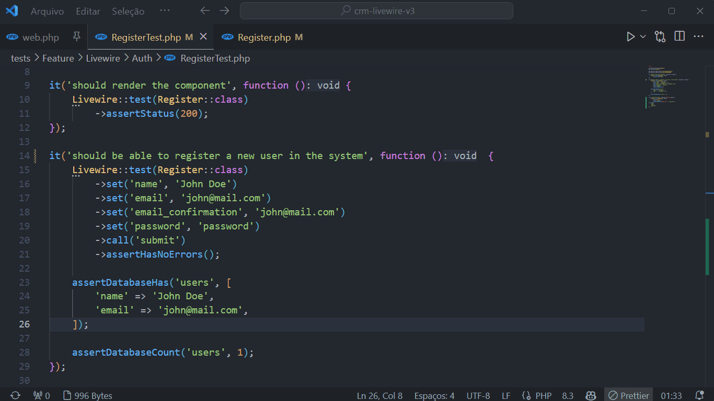
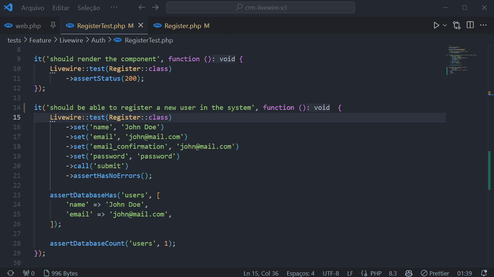
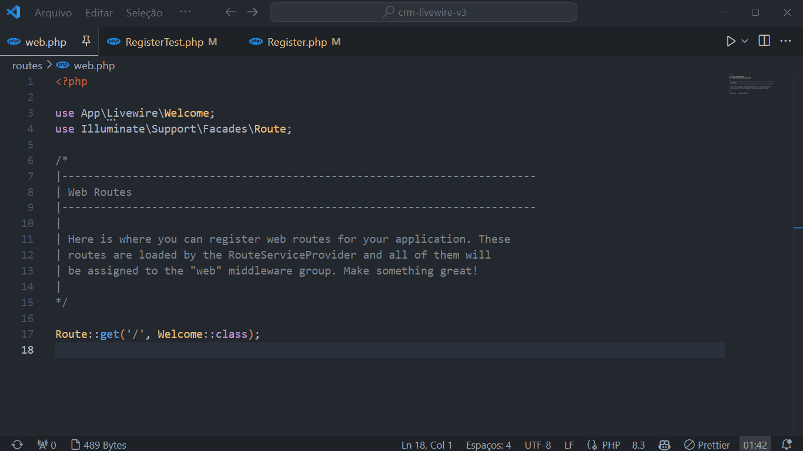

# Artisan Test Shortcut

This extension provides keyboard shortcuts to run Artisan Test commands in Visual Studio Code. It is especially useful for developers working with Laravel who want to run tests quickly.

### Screenshots

## Keyboard Shortcuts

Here are the available keyboard shortcuts and what each of them does:

- `Ctrl+Shift+F11`: Runs the `artisan test` command to run all tests.
- `Ctrl+Shift+F9`: Runs the `artisan test` command on the current file if the file ends with `Test.php`. Otherwise, it runs the `artisan test --dirty` command.
- `Ctrl+Shift+F10`: Runs the `artisan test --filter` command and prompts the user to enter the filter tag for the test.

## Commands

### Run Artisan Test

- **Command:** `artisanTest.runTest`
- **Description:** Runs the `artisan test` command and allows the user to choose between the options:
  - All Files
  - All Files With Parallel (`--parallel`)
  - Files Dirty (`--dirty`)

### Run Artisan Test File

- **Command:** `artisanTest.runTestFile`
- **Description:** Runs the `artisan test` command on the current file if the file ends with `Test.php`.

### Run Artisan Test Filter

- **Command:** `artisanTest.runTestFilter`
- **Description:** Runs the `artisan test --filter` command and prompts the user to enter the filter tag for the test.

### Run Artisan Test Dirty

- **Command:** `artisanTest.runTestDirty`
- **Description:** Runs the `artisan test --dirty` command.

## Installation

1. Install the extension from the Visual Studio Code Marketplace.
2. Open Visual Studio Code.
3. Go to the Extensions view (`Ctrl+Shift+X`).
4. Search for "Artisan Test Shortcut" and install the extension.

## Usage

1. Open a Laravel project with PHP files in Visual Studio Code.
2. Use the keyboard shortcuts mentioned above to run the Artisan Test commands.

## Contribution

Feel free to contribute with improvements or fixes. Fork the repository, create a branch for your changes, and submit a pull request.

## Development

For instructions on how to develop and test this extension, see [DEVELOPMENT.md](DEVELOPMENT.md).

## License

This extension is licensed under the MIT license. See the LICENSE file for more information.

**Enjoy!**

## Repository

[GitHub Repository](https://github.com/jjdevzinho/artisan-test-shortcut)
